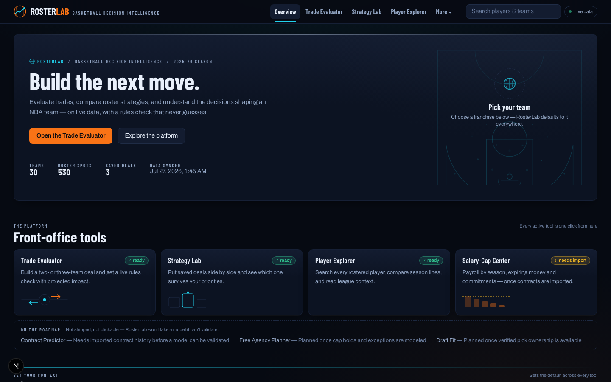
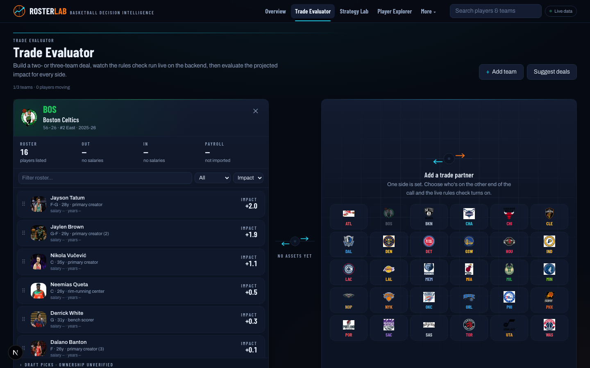
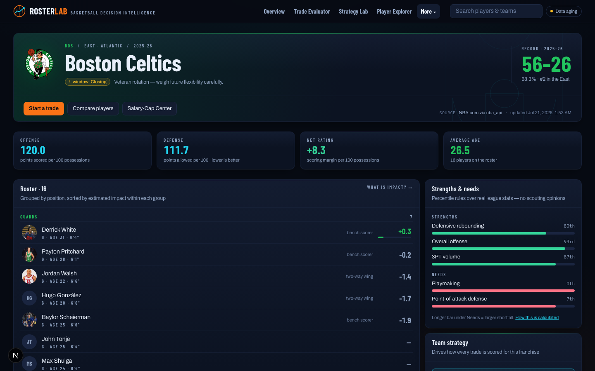
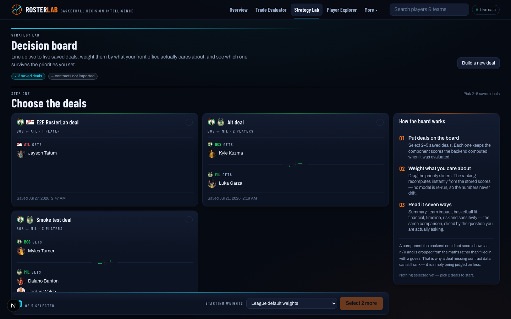
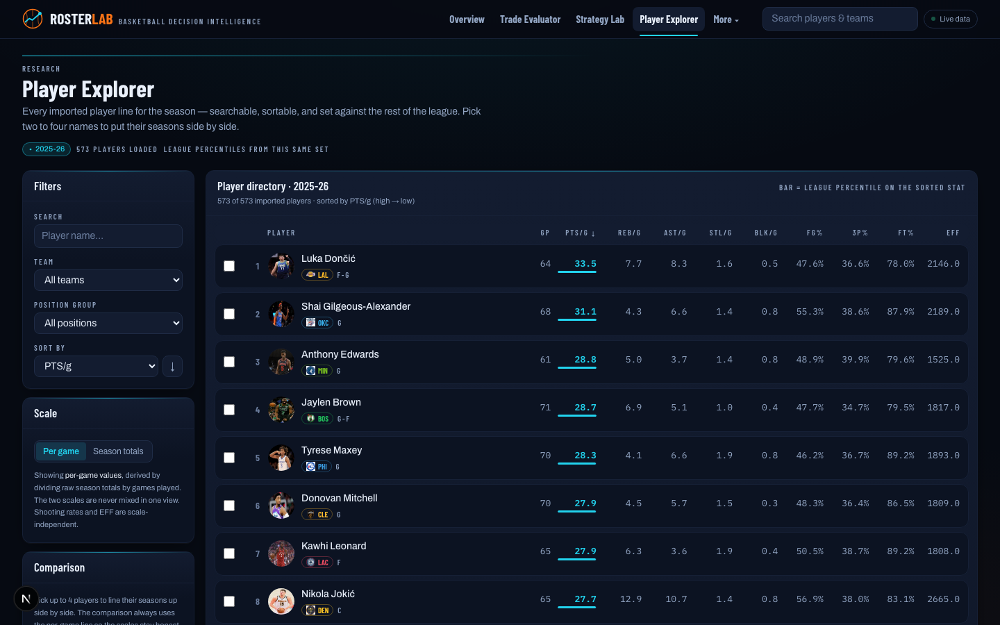
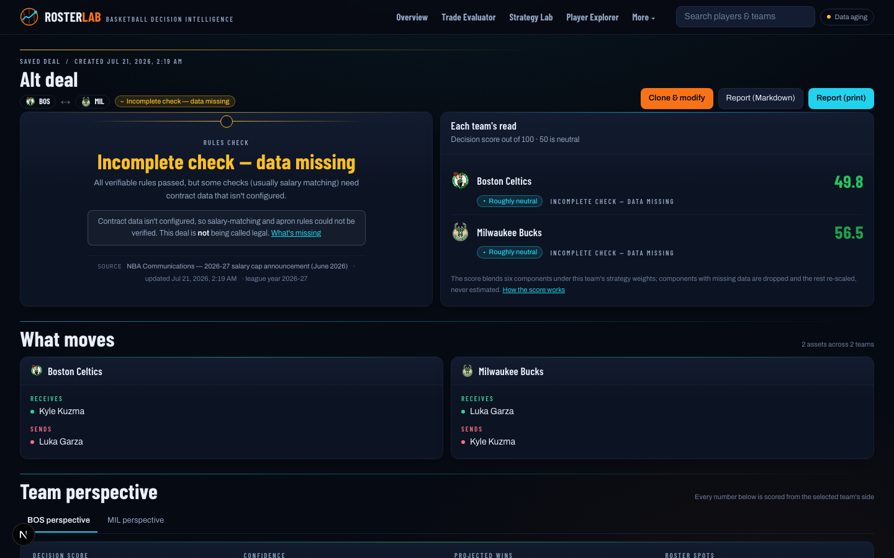

# RosterLab — Basketball Decision Intelligence

**Build the next move: evaluate trades against live NBA rosters, compare roster strategies, and understand the decisions shaping a team — every number traceable to its source.**

RosterLab is a full-stack basketball decision platform: real provider-backed NBA data, a CBA-aware rules engine with a four-state honesty standard, validated player-impact modeling, and a broadcast-grade product layer (team identity, player photos, plain-language verdicts) over serious, inspectable analytics.



> **Status:** fully functional local build. Data below was ingested live from NBA.com (July 2026), enriched from a user CSV, the Kaggle basketball database, and local image datasets. **Not affiliated with the NBA.**

---

## The tool suite

| Module | What it does | Status |
| --- | --- | --- |
| **Trade Evaluator** | The flagship. Two- and three-team deals across team workspaces joined by a transaction lane; drag-and-drop with accessible send controls, a live backend rules check, fan verdict then advanced analysis, save and share links | available |
| **Strategy Lab** | A decision board: visual deal cards, a component matrix, priority sliders that re-rank live, the trade-off frontier and rank stability | available |
| **Player Explorer** | 573 imported 2025-26 stat lines: photos, totals *and* derived per-game (never mixed), league percentiles, 2–4-player comparison | available |
| **Team Outlook** | Broadcast-style team dashboard: roster by position group, model-derived strengths & needs, competitive window, payroll honesty, strategy setup | available |
| **Salary-Cap Center** | Payroll by season, top/expiring contracts, option markers, cap reference lines — activates when contracts are imported | needs contract import |
| **Precedent** | Ten seasons of completed trades, normalized locally. Ask what a proposal resembles and get back real transactions with a per-dimension similarity breakdown — and the statement that resemblance is not consequence | available |
| **Who fixes this?** | Start from a diagnosed need instead of a trade: filtered candidates, ranked by projected wins, each one already run through the trade evaluator with a balancing package | available |
| **Decision memo** | The whole analysis as one reviewable document — recommendation, rotation consequences, fit, cost, rules, precedent, risks, and one consolidated section naming what could not be established | available |
| **Contract Predictor** | Deliberately **on the roadmap**: needs historical contract data before a validated model can exist — RosterLab ships no fake models | roadmap |

Routes were renamed to match these module names; every previous URL still redirects (share links keep their query strings).

## Data sources & hierarchy

Six sources, joined by **stable NBA IDs** with recorded confidence (see [docs/identity-resolution.md](docs/identity-resolution.md)); conflicts are logged, never silently overwritten:

1. **NBA.com via [`nba_api`](https://github.com/swar/nba_api)** (authoritative): teams, players, rosters, standings, stats, games — hardened client with rate limiting, retries, circuit breaker, schema contracts.
2. **User CSV** (`data/imports/nba_player_stats_2026.csv`): 2025-26 season **totals**, imported by official `PLAYER_ID` (573/582 matched; 9 unmatched recorded), per-game derived safely via GP.
3. **Kaggle [`wyattowalsh/basketball`](https://www.kaggle.com/datasets/wyattowalsh/basketball)** via `kagglehub`: historical bio/draft enrichment — fills only NULL fields (4,516 players enriched; 273 conflicts preserved un-overwritten).
4. **Basketball-Reference contracts snapshot** (user-downloaded page, parsed locally — no live scraping): salaries by league year with option markers; enables salary-matching rules and Cap Lab.
5. **Basketball-Reference season transaction pages** (`make fetch-transactions`, one request per season 3.5 s apart, honouring the source's published `Crawl-delay: 3`): **565 completed trades across 2016-17 … 2025-26**, 2,568 asset legs, 69 of them multi-team. 89.4 % of player legs resolve to a player here; the rest are filed as warnings and none is fuzzy-matched. Raw pages stay gitignored.
6. **Local image datasets** (gitignored): 30/30 team logos, 2,196/2,476 player-image folders resolved to identities by name→ID matching (280 unmatched kept for review); served by the backend with deterministic fallbacks.

**Data Status** shows six plain-language source cards (fresh / stale / derived / incomplete / unavailable) with coverage and the exact next step for anything missing.

## Honesty guarantees

- A trade is **never** labeled legal from partial validation: `passes / fails / incomplete (data missing) / not checked`.
- Missing salaries, injuries, or pick ownership are explicit unavailable states — never estimated.
- Season totals are never presented as per-game values; proxies are labeled as proxies.
- Every screen shows source + last-updated; every model shows its validation numbers.

## The analytics (validated, inspectable)

- **TEI (estimated player impact)**: a transparent weighted z-score index over recency-weighted 3-season features, time-aware validation against a persistence baseline (**0.645 vs 0.717 held-out MAE**); per-player uncertainty bands from σ² = 0.0326 + 240.9/minutes. A ridge challenger was retired in R3-1: it won on player-level MAE (0.637) and explained **R² = 0.004** of team net rating against the index's **0.751**. [Model card](docs/model-card-player-impact.md).
- **Wins projection**: 240-minute rotation reallocation with availability discounting; net-rating→wins slope **calibrated on 90 team-seasons (2.24, R²=0.95)**; 2,000-draw Monte Carlo per evaluation.
- **Decision score**: six weighted components (missing components excluded, weights renormalized) + Dirichlet rank-stability and tornado sensitivity.
- **CBA engine**: expanded/standard TPE bands (verified 2025-26 & 2026-27 figures), apron restrictions, aggregation prohibition, roster limits, recently-signed windows. [Rule-by-rule coverage](docs/cba-rule-coverage.md).
- **Comparable-trade retrieval**: an interpretable grouped distance over 337 rankable team-sides. Archetype precision@5 **0.817** against a 0.414 base rate, with a random ranker at 0.397 and a shuffled-feature corpus at 0.395; direction confusion **0.010**; the whole battery re-runs with `make comparable-validation`.
- **Need-driven discovery**: filtered by the need, ranked by projected wins, then put through the trade evaluator under the candidate generator's own conditions — which takes the distinct players named across the league's top fives from **26 to 72**. `make acquisition-validation`.

Full write-up: [docs/methodology.md](docs/methodology.md) · in-product: `/methodology` (plain-language layer + technical layer).

## Screenshots

| Trade Evaluator | Team Outlook |
| --- | --- |
|  |  |

| Strategy Lab | Data Health |
| --- | --- |
|  |  |

| Player Explorer | Saved deal report |
| --- | --- |
|  |  |

## Getting started

```bash
make setup          # backend venv + frontend npm install + .env from template
make migrate        # Alembic (SQLite by default; Postgres via DATABASE_URL)
make seed-config    # verified salary-cap parameters (2025-26 + 2026-27)
make sync-data      # live NBA data from NBA.com via nba_api (network)
make train && make score
make dev            # backend :8000 + frontend :3000
```

### Optional data imports

```bash
make index-assets      # player photos (./nbaplayerimages) + team logos (./nbalogos)
make import-stats-csv  # 2025-26 season totals (data/imports/nba_player_stats_2026.csv)
make import-kaggle     # Kaggle basketball DB enrichment (~700MB download; no auth for
                       # public datasets — see docs/kaggle-setup.md)
# Contracts: save basketball-reference.com/contracts/players.html to
# data/imports/contracts/players.html, set CONTRACT_DATA_PROVIDER=bbref_snapshot,
# then: make sync-data   (see data/imports/README.md)

make fetch-transactions FROM=2017 TO=2026   # completed trades, one page per season
make import-transactions                     # parse them into historical_trades
make transaction-coverage                    # what the corpus holds
```

Containerized: `docker compose up --build` (Postgres 16 + Redis 7 + API + worker + frontend).

### Testing

```bash
make test                     # backend pytest (867) + frontend vitest (45)
make lint                     # ruff + mypy + eslint + tsc
make e2e                      # Playwright core flows against the local stack (5 specs)
make comparable-validation    # comparable-trade battery; exits non-zero on a threshold
make acquisition-validation   # need-driven discovery battery, over all 30 rosters
make lineup-availability      # re-measure whether lineup data could support a fit model
```

Visual QA is scripted too — `node scripts/visual_qa.mjs docs/qa/run` screenshots every
route at 1920/1440/1366/1280/1024/768/390 and fails loudly on horizontal overflow or
console errors. Its output is gitignored; the curated shots above live in
`docs/screenshots/`.

## Repository policy

No NBA data, images, or licensed datasets are committed — everything is fetched or imported locally by the operator with provenance. Test fixtures are tiny, clearly-marked synthetic records. See [data/README.md](data/README.md).

## Documentation

[Enhancement plan](docs/rosterlab-enhancement-plan.md) · [Architecture](docs/architecture.md) · [Methodology](docs/methodology.md) · [CBA coverage](docs/cba-rule-coverage.md) · [Data sources](docs/data-sources.md) · [Data dictionary](docs/data-dictionary.md) · [Identity resolution](docs/identity-resolution.md) · [Kaggle setup](docs/kaggle-setup.md) · [Decision log](docs/decision-log.md) · [Model cards](docs/model-card-player-impact.md) · [Limitations](docs/limitations.md) · [Demo script](docs/demo-script.md) · [Interview guide](docs/interview-guide.md)

## Roadmap

Salary Predictor (once historical contract data exists) · Free Agency Planner · Draft Fit · Rotation Builder · Extension Simulator — represented in the product as honest "coming soon" states, never fake functionality.

## Disclaimer

Independent portfolio project; not affiliated with or endorsed by the NBA or NBPA. NBA data is retrieved at runtime under the source sites' terms and is not redistributed. Team names/logos and player images belong to their owners and are used locally for identification. This is an analytical simulator, not professional cap-management or investment advice.
