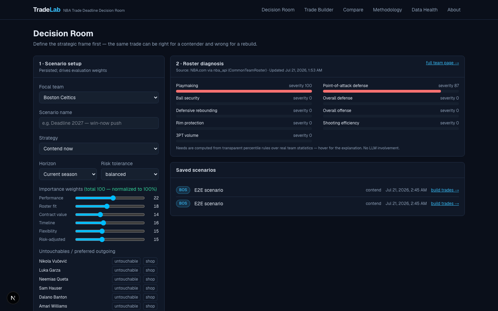

# TradeLab — NBA Trade Deadline Decision Room

**A decision-support system that turns "should we make this trade?" into a structured, honest, explainable analysis** — built on real NBA data from NBA.com via [`nba_api`](https://github.com/swar/nba_api), a CBA-aware legality engine, and a multi-component evaluation framework with quantified uncertainty.


> **Live demo:** _placeholder — see [Deployment](#deployment)_ · **Status:** fully functional local build; all data below ingested live from NBA.com on July 20, 2026.

---

## The problem

NBA front offices don't evaluate trades with one number. A single deal simultaneously affects current performance, rotation balance, positional fit, salary-cap and apron law, luxury-tax exposure, competitive timelines, asset optionality, and downside risk — and the right answer depends on *which* of those the organization currently values. Public trade machines collapse this into a binary "works/doesn't work." TradeLab instead models the actual decision:

> Given this team's roster, timeline, financial position, strategic priorities, and risk tolerance, which trade alternative creates the strongest organizational outcome — and does that conclusion survive changed assumptions?

## Who it's for

- **Basketball-operations analysts** — construct legal or near-legal structures, compare alternatives, surface assumptions, export an executive memo.
- **Executives** — a concise recommendation with tradeoffs, cap consequences, upside/downside scenarios, and confidence.
- **Portfolio reviewers** — a demonstration of structured decision-making under complex constraints (see [docs/interview-guide.md](docs/interview-guide.md)).

## Key capabilities

| Capability | How |
| --- | --- |
| **Real, current NBA data** | Teams, players, rosters, standings, stats, games from NBA.com via `nba_api` 1.11.4 — provenance (provider, endpoint, timestamps, run ID) stored on every record, freshness badged on every screen |
| **Trade legality** | Modular 2023-CBA rules engine: expanded/standard TPE salary-matching bands, first/second-apron limits, aggregation prohibition, roster limits, recently-signed windows, no-trade clauses, two-way exclusions |
| **Four-state honesty** | `verified_legal` · `verified_illegal` · `conditionally_valid` · `not_evaluated` — partial validation is **never** presented as legal |
| **Player impact** | TradeLab Estimated Impact (TEI): ridge model vs transparent index, chosen by time-aware validation (no season leakage), with uncertainty bands |
| **Evaluation** | U = w·(performance, fit, contract, timeline, flexibility, risk) on 0–100; unavailable components are excluded and weights renormalized — never faked |
| **Uncertainty** | 2,000-draw Monte Carlo over impact, availability, minutes, and wins-conversion; median / p10–p90 / P(positive) |
| **Sensitivity** | Dirichlet-sampled weight perturbation → first-place share and rank volatility; tornado charts |
| **Recommendation search** | Constrained beam search over real rosters with both-sides utility floors — clearly labeled model exploration, not predictions |

## Architecture

```
Next.js 16 (App Router, Tailwind, TanStack Query, dnd-kit, Recharts)
        │  /api/v1 (rewrite)
        ▼
FastAPI ──┬─ api/v1: teams · players · scenarios · trades · comparisons · data-health
          ├─ cba/: TradeRule engine + TradeContext builder (backend-authoritative)
          ├─ services/: evaluation · candidates · reports · payroll · data health
          ├─ analytics/: features · TEI · archetypes · needs · fit · projection ·
          │              uncertainty · sensitivity  (scikit-learn, fixed seeds)
          ├─ ingestion/: idempotent jobs + run bookkeeping + quality checks
          ├─ db/: SQLAlchemy 2 (31 tables, UUID PKs, provenance columns) + Alembic
          └─ integrations/
              ├─ nba_api/: client (rate limit · retry+jitter · circuit breaker ·
              │            cache · schema validation · health) → NBA.com
              └─ contracts/: ContractProvider interface (optional; none bundled)
Postgres 16 + Redis 7 (docker compose) · SQLite + in-process cache (local dev)
```

Details: [docs/architecture.md](docs/architecture.md) · rationale: [docs/decision-log.md](docs/decision-log.md)

## Data sources and freshness

- **NBA.com via `nba_api`** (required, primary): identity, rosters, standings, stats, games. Live-game endpoints (cdn.nba.com) are supported but disabled by default (offseason) and surface classified errors when unreachable.
- **Contracts**: `nba_api` does not provide contract data. TradeLab ships **no** contract provider; salary features honestly report *unavailable* until you configure one (see [data/contracts/README.md](data/contracts/README.md)). Missing salaries are never estimated.
- **Cap parameters**: version-controlled YAML verified against official NBA releases ([2025-26](backend/app/config/cap_rules/2025-26.yaml), [2026-27](backend/app/config/cap_rules/2026-27.yaml)).
- **Injuries / verified pick ownership**: no provider bundled → labeled unavailable; availability uses historical games played; picks are hypothetical and labeled.

Every screen shows `Source: NBA.com via nba_api · Updated <timestamp>` plus stale badges past TTL; `/data-health` shows per-table freshness, sync history, quality issues, and model versions.


## The math (summary)

- **Composite utility** `U = Σ w_k·C_k`, components normalized to 0–100 (50 = neutral), user-controlled weights with `Σw=1`; unavailable components excluded + weights renormalized.
- **TEI**: recency-weighted (λ=0.7, minutes-weighted) 3-season features → ridge regression predicting next-season `0.6·z(PIE)+0.4·z(NET_RATING)`; validated on the held-out 2024-25→2025-26 transition (**MAE 0.637 vs 0.717 persistence baseline**); transparent weighted-index fallback.
- **Wins**: `ΔW ≈ slope·ΔNetRating·(G/82)` with slope **calibrated on 90 ingested team-seasons (2.24 wins/point, R²=0.95)** — not a hard-coded constant.
- **Rotation**: 240 minutes reallocated proportionally with caps, user overrides, availability discounting, replacement-level fill-in.
- **Fit**: `F = Σ n_k·Δs_k − γ·Σ max(0, r_k)` over percentile skill vectors vs transparent, rule-based team needs.

Full write-up with formulas and limitations: [docs/methodology.md](docs/methodology.md) · model cards: [impact](docs/model-card-player-impact.md), [market value](docs/model-card-market-value.md), [team projection](docs/model-card-team-projection.md)

## Trade legality scope

Implemented and unit-tested: salary-data availability, expanded TPE (200%+$250K / +$9.096M band / 125%+$250K, scaled per league year), standard TPE for apron teams (100%+$250K), second-apron aggregation prohibition, minimum team salary, roster limits (with honest two-way ambiguity), recently-signed windows, no-trade clauses, two-way exclusions, Stepien (reports unavailable without authoritative pick data).

**Not implemented** (documented, never silently faked): sign-and-trades, trade exceptions, cash, base-year compensation, hard-cap triggers. Rule-by-rule coverage with formulas, sources, and tests: [docs/cba-rule-coverage.md](docs/cba-rule-coverage.md).

> TradeLab is an analytical portfolio project — **not** an official NBA cap-management product.

## Screenshots

| Decision room | Trade evaluation |
| --- | --- |
|  |  |

| Team page | Trade builder |
| --- | --- |
|  |  |

## Getting started

```bash
git clone <this repo> && cd <repo>
make setup          # backend venv + frontend npm install + .env from template
make migrate        # Alembic → SQLite by default (Postgres via DATABASE_URL)
make seed-config    # load verified salary-cap parameters
make sync-data      # ingest current NBA data from NBA.com via nba_api (network)
make train          # features → TEI + archetypes + wins calibration
make score          # team needs
make dev            # backend :8000 + frontend :3000
```

Or containerized (Postgres + Redis + API + worker + frontend):

```bash
docker compose up --build
```

### Environment variables

See [.env.example](.env.example). Notables: `DATABASE_URL`, `REDIS_URL` (optional), `NBA_API_*` throttling safeguards, `CURRENT_SEASON`, `CAP_LEAGUE_YEAR`, `CONTRACT_DATA_PROVIDER` (optional), `ADMIN_TOKEN` (protects `/api/v1/admin/sync`), `LIVE_DATA_ENABLED`.

### Testing

```bash
make test       # backend pytest (76 tests) + frontend vitest (14 tests)
make lint       # ruff + mypy + eslint + tsc — all clean
make e2e        # Playwright (3 specs) against the local stack
```

API docs: http://localhost:8000/docs (OpenAPI).

## Deployment

- **Frontend**: Vercel (`frontend/`, set `NEXT_PUBLIC_API_URL`).
- **Backend**: any container host (Render/Railway/Fly.io) using `backend/Dockerfile`; run `alembic upgrade head` on release; managed Postgres + Redis; run `python -m app.worker` as a background service for scheduled syncs.
- The app **fails safely without credentials**: no contract provider → salary features unavailable; NBA.com unreachable → classified errors, last snapshot retained, stale badges shown. A demo deployment should state its snapshot date (the UI's freshness lines do this automatically).

## Limitations (honest scope)

No bundled contract/injury/pick providers; TEI is box-score-based; CBA coverage is a documented subset; single-season wins mapping assumes roster-context stability. Full list: [docs/limitations.md](docs/limitations.md).

## Roadmap

Lineup-level on/off ingestion → TEI v2 · contract-provider adapters + market-salary model with historical data · three-team candidate search · draft-pick valuation with authoritative ownership · report PDF export.

## Documentation

[Product requirements](docs/product-requirements.md) · [Architecture](docs/architecture.md) · [Methodology](docs/methodology.md) · [CBA coverage](docs/cba-rule-coverage.md) · [Data sources](docs/data-sources.md) · [Data dictionary](docs/data-dictionary.md) · [Decision log (ADRs)](docs/decision-log.md) · [Limitations](docs/limitations.md) · [Demo script](docs/demo-script.md) · [Resume bullets](docs/resume-bullets.md) · [Interview guide](docs/interview-guide.md)

## Disclaimer

Independent portfolio project; not affiliated with or endorsed by the NBA or NBPA. NBA data is retrieved at runtime from NBA.com under its terms and is not redistributed here. Team names/trademarks belong to their owners. No player photography is used (initials avatars only). Nothing here is professional cap or investment advice.

## Resume-ready summary

Built a full-stack NBA trade decision-support platform (Next.js, FastAPI, PostgreSQL, Redis, scikit-learn) on live provider-backed NBA data with a modular CBA legality engine, validated player-impact modeling, Monte Carlo uncertainty, and weight-sensitivity analysis — engineered for data honesty end to end: provenance on every record, explicit unavailable states, and a four-state legality standard that never overstates certainty.
