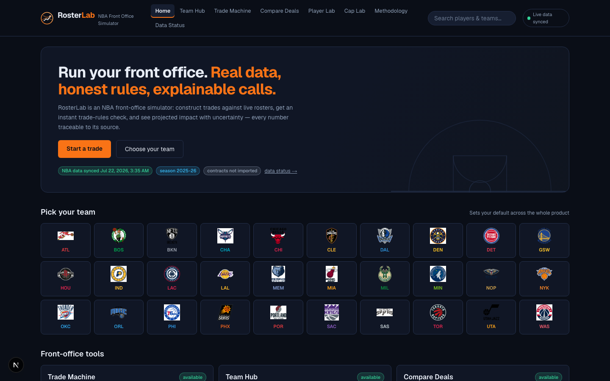
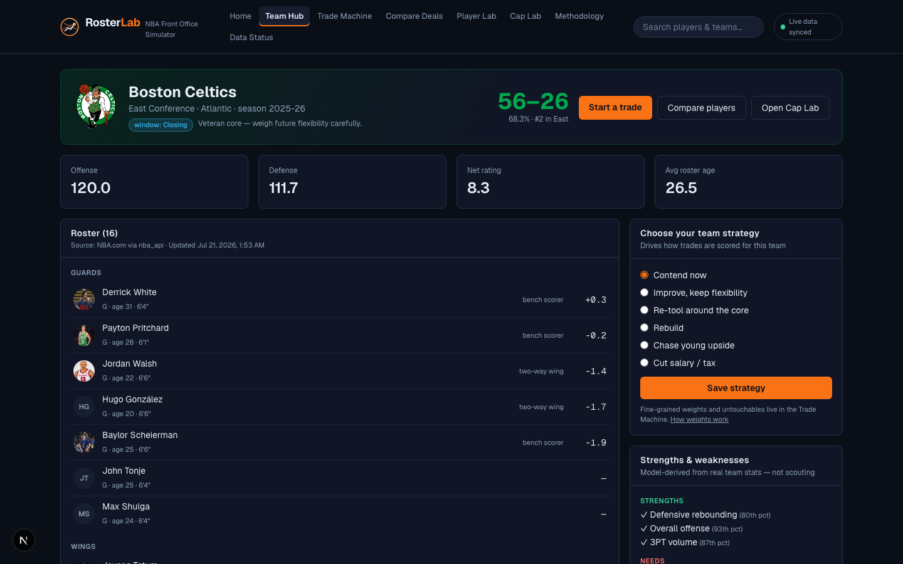
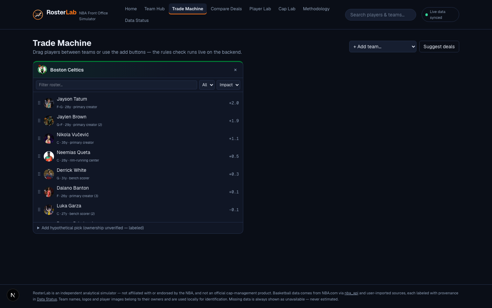
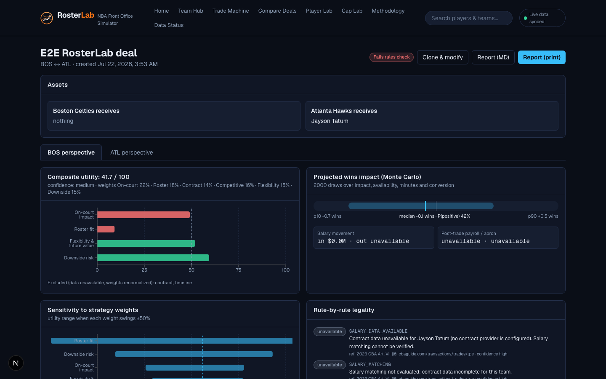
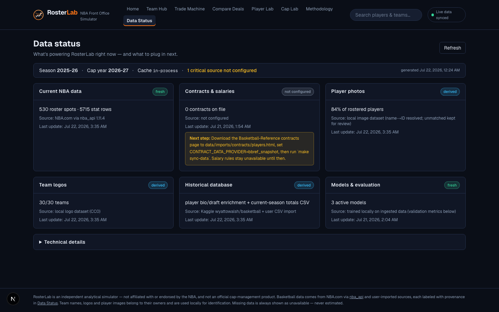

# RosterLab — NBA Front Office Simulator

**Run your front office: build trades against live NBA rosters, get an honest trade-rules check, and see projected impact with uncertainty — every number traceable to its source.**

RosterLab is a full-stack front-office simulator: real provider-backed NBA data, a CBA-aware rules engine with a four-state honesty standard, validated player-impact modeling, and a fan-friendly product layer (team logos, player photos, plain-language verdicts) over serious, inspectable analytics.



> **Status:** fully functional local build. Data below was ingested live from NBA.com (July 2026), enriched from a user CSV, the Kaggle basketball database, and local image datasets. **Not affiliated with the NBA.**

---

## The tool suite

| Tool | What it does | Status |
| --- | --- | --- |
| **Team Hub** | Roster with photos grouped by position, model-derived strengths & needs, competitive window, payroll honesty, strategy setup | available |
| **Trade Machine** | 2–3-team trades: drag-and-drop with accessible fallbacks, live backend rules check, fan verdict + advanced analytics, save/share links | available |
| **Compare Deals** | Saved deals side by side: component matrix, live priority sliders that re-rank on the fly, Pareto frontier, rank-stability | available |
| **Player Lab** | 573 imported 2025-26 stat lines: photos, totals *and* derived per-game (never mixed), league percentiles, 2–4-player comparison | available |
| **Cap Lab** | Payroll by season, top/expiring contracts, option markers, cap reference lines — activates when contracts are imported | needs contract import |
| **Salary Predictor** | Deliberately **coming soon**: needs historical contract data before a validated model can exist — RosterLab ships no fake models | roadmap |

## Data sources & hierarchy

Five sources, joined by **stable NBA IDs** with recorded confidence (see [docs/identity-resolution.md](docs/identity-resolution.md)); conflicts are logged, never silently overwritten:

1. **NBA.com via [`nba_api`](https://github.com/swar/nba_api)** (authoritative): teams, players, rosters, standings, stats, games — hardened client with rate limiting, retries, circuit breaker, schema contracts.
2. **User CSV** (`data/imports/nba_player_stats_2026.csv`): 2025-26 season **totals**, imported by official `PLAYER_ID` (573/582 matched; 9 unmatched recorded), per-game derived safely via GP.
3. **Kaggle [`wyattowalsh/basketball`](https://www.kaggle.com/datasets/wyattowalsh/basketball)** via `kagglehub`: historical bio/draft enrichment — fills only NULL fields (4,516 players enriched; 273 conflicts preserved un-overwritten).
4. **Basketball-Reference contracts snapshot** (user-downloaded page, parsed locally — no live scraping): salaries by league year with option markers; enables salary-matching rules and Cap Lab.
5. **Local image datasets** (gitignored): 30/30 team logos, 2,196/2,476 player-image folders resolved to identities by name→ID matching (280 unmatched kept for review); served by the backend with deterministic fallbacks.

**Data Status** shows six plain-language source cards (fresh / stale / derived / incomplete / unavailable) with coverage and the exact next step for anything missing.

## Honesty guarantees

- A trade is **never** labeled legal from partial validation: `passes / fails / incomplete (data missing) / not checked`.
- Missing salaries, injuries, or pick ownership are explicit unavailable states — never estimated.
- Season totals are never presented as per-game values; proxies are labeled as proxies.
- Every screen shows source + last-updated; every model shows its validation numbers.

## The analytics (validated, inspectable)

- **TEI (estimated player impact)**: ridge model over recency-weighted 3-season features, time-aware validation — held-out **MAE 0.637 vs 0.717 persistence**; uncertainty bands from residuals. [Model card](docs/model-card-player-impact.md).
- **Wins projection**: 240-minute rotation reallocation with availability discounting; net-rating→wins slope **calibrated on 90 team-seasons (2.24, R²=0.95)**; 2,000-draw Monte Carlo per evaluation.
- **Decision score**: six weighted components (missing components excluded, weights renormalized) + Dirichlet rank-stability and tornado sensitivity.
- **CBA engine**: expanded/standard TPE bands (verified 2025-26 & 2026-27 figures), apron restrictions, aggregation prohibition, roster limits, recently-signed windows. [Rule-by-rule coverage](docs/cba-rule-coverage.md).

Full write-up: [docs/methodology.md](docs/methodology.md) · in-product: `/methodology` (plain-language layer + technical layer).

## Screenshots

| Team Hub | Trade Machine |
| --- | --- |
|  |  |

| Deal evaluation | Data Status |
| --- | --- |
|  |  |

## Getting started

```bash
make setup          # backend venv + frontend npm install + .env from template
make migrate        # Alembic (SQLite by default; Postgres via DATABASE_URL)
make seed-config    # verified salary-cap parameters (2025-26 + 2026-27)
make sync-data      # live NBA data from NBA.com via nba_api (network)
make train && make score
make dev            # backend :8000 + frontend :3000
```

### Optional data imports

```bash
make index-assets      # player photos (./nbaplayerimages) + team logos (./nbalogos)
make import-stats-csv  # 2025-26 season totals (data/imports/nba_player_stats_2026.csv)
make import-kaggle     # Kaggle basketball DB enrichment (~700MB download; no auth for
                       # public datasets — see docs/kaggle-setup.md)
# Contracts: save basketball-reference.com/contracts/players.html to
# data/imports/contracts/players.html, set CONTRACT_DATA_PROVIDER=bbref_snapshot,
# then: make sync-data   (see data/imports/README.md)
```

Containerized: `docker compose up --build` (Postgres 16 + Redis 7 + API + worker + frontend).

### Testing

```bash
make test    # backend pytest (114) + frontend vitest
make lint    # ruff + mypy + eslint + tsc
make e2e     # Playwright core flows against the local stack
```

## Repository policy

No NBA data, images, or licensed datasets are committed — everything is fetched or imported locally by the operator with provenance. Test fixtures are tiny, clearly-marked synthetic records. See [data/README.md](data/README.md).

## Documentation

[Enhancement plan](docs/rosterlab-enhancement-plan.md) · [Architecture](docs/architecture.md) · [Methodology](docs/methodology.md) · [CBA coverage](docs/cba-rule-coverage.md) · [Data sources](docs/data-sources.md) · [Data dictionary](docs/data-dictionary.md) · [Identity resolution](docs/identity-resolution.md) · [Kaggle setup](docs/kaggle-setup.md) · [Decision log](docs/decision-log.md) · [Model cards](docs/model-card-player-impact.md) · [Limitations](docs/limitations.md) · [Demo script](docs/demo-script.md) · [Interview guide](docs/interview-guide.md)

## Roadmap

Salary Predictor (once historical contract data exists) · Free Agency Planner · Draft Fit · Rotation Builder · Extension Simulator — represented in the product as honest "coming soon" states, never fake functionality.

## Disclaimer

Independent portfolio project; not affiliated with or endorsed by the NBA or NBPA. NBA data is retrieved at runtime under the source sites' terms and is not redistributed. Team names/logos and player images belong to their owners and are used locally for identification. This is an analytical simulator, not professional cap-management or investment advice.
